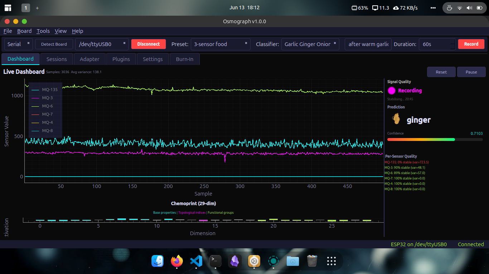

# Osmograph — Electronic Nose Desktop Application


*Osmograph showing real-time sensor traces, competition grid with class probabilities, and the substance identification display.*

Desktop GUI for OpenSmell hardware: connect to your ESP32 board, record sensor sessions, train classifiers, and identify substances in real time.

## Quick Start

```bash
# Install dependencies
pip install -r requirements.txt

# Launch
python -m Osmograph
```

## Architecture

```
Osmograph/
├── board/          # Board detection, firmware compiler (WiFi + Serial)
├── sensor/         # Sensor profiles, pin mapping, hardware presets
├── data/           # Serial reader, WiFi reader, CSV recorder, session management
├── viz/            # Live traces, competition grid, substance display, chemoprint
├── burnin/         # Persistent burn-in timer
├── wizard/         # Adapter training wizard
├── ui/             # Dark theme, dialogs
├── firmware/       # Pre-compiled firmware binary
├── classifiers/    # User-trained classifier models (.pkl)
└── app.py          # Main window
```

## Features

- **Board Manager**: Auto-detect ESP32, one-click firmware flash via esptool
- **USB Serial and WiFi**: connect over USB or the ESP32's built-in AP + TCP server (both active simultaneously, no modes to select)
- **Live Visualization**: PyQtGraph real-time traces, competition grid, substance display
- **Recording**: Labeled CSV sessions with auto-save
- **Classifier Training**: Record a few substances, train a RandomForest or LogisticRegression model
- **Real-time Prediction**: Competition grid animates with class probabilities; locks on sustained high confidence
- **Burn-In Tracker**: 24h sensor stabilization countdown across restarts
- **Plugin System**: Drop `.py` plugin scripts or `.head` model files into the plugins folder — each exposes a `run(latent_vector)` function called on every prediction

## Firmware

Osmograph includes an ESP32 firmware that works with any sensor count (1–6 MQ sensors).

- **USB Serial** + **WiFi AP** simultaneously — no modes to select
- **No PlatformIO required**: the app flashes a pre-compiled binary via esptool
- **Custom pins**: use the Pin Mapping dialog in the app to export a custom sketch, or if compiling from source, edit the `SENSOR_PINS[]` array in `board/compiler.py`
- **Data format**: each line is `OSM,<adc0>,<adc1>,...` over serial or TCP (port 8080)

The pre-compiled binary at `firmware/firmware_universal.bin` works with any subset of sensors and is flashed via esptool — no PlatformIO or VSCode needed. The firmware source lives in [`board/compiler.py`](board/compiler.py) if you want to customise and recompile.

## Hardware Presets

The app ships with common sensor configurations in `sensor/presets.py`. When you auto-detect a board, you select the preset that matches your hardware, and Osmograph handles the rest — including flashing the correct firmware.

To add a custom configuration, add a new entry to `sensor/presets.py` with your pin mapping.
